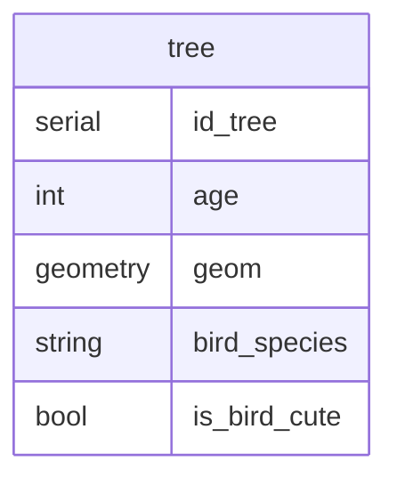
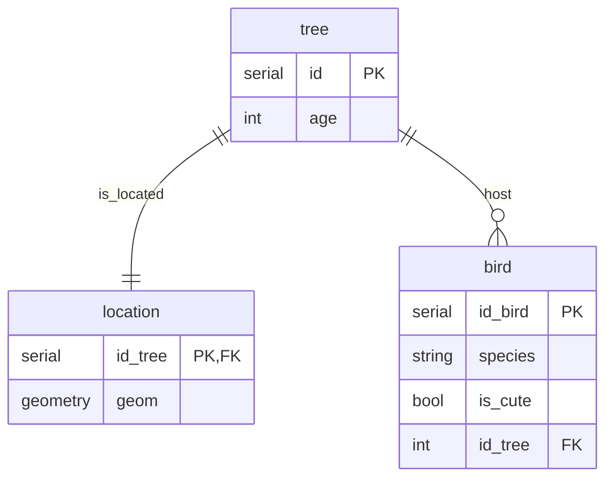

QGIS is an amazing tool. Being spatial analysis or digitizing data, it's efficient, highly customable and extensible. There is so much you can do with it.

So it's only natural that we want to share a project that we are working on and propose to other people to join our effort on our amazing data digitizing/spatial statistics calculating masterpiece. Well yes of course, things are better when they are shared (most of them at least), and we go further together than alone (wow very profound), but this is something that has to be given some thoughts beforehand to ensure that everything goes smoothly within the collaboration.

We'll briefly have a look at what can help make collaborating with QGIS successful. Also, we'll be talking a lot about **projects**, we are referring here to the literal QGIS file used to store the work environment (data, visualizations, etc.). It's not **project** in the sense of a _project management_, but some things might be useful to apply from the project management world. And in any case, working together requires tools outside of the technical aspects.

## When does this apply?

Obviously if you're alone on your project or working with a handful of people, some points might feel over-the-top or even counter productive, but some questions are always useful to be asked and it can be helpful to use some "good" practice, even when working for ourselves. 

For the last years I had to pick up some projects that were shared by tens of people, create new ones, and I can safely say that there need to be rules when more people are getting on board.

So if you work with spatial data and you need to have people collaborating using QGIS you might be interested

## Ok let's go, how to collaborate with QGIS?

This is obviously from my personal experience. It's not exhaustive, or maybe not accurate, but if it can help..

### tl;dr

* **Scope your project**: have objectives for the project and keep it within controlled boundaries.
* **Have a data structure**: define which data will be included and model them.
* **Give roles and responsibilities**: have a project management in place.
* **Version control**: track changes and decompose your project if it becomes too big.
* **Share it efficiently**: have everything in a single place, keep it as simple as possible, save it in database.

### Scope your project

It sometimes feels like it's a bad thing to say in an Agile world, but giving some boundaries to the project helps staying on track. Maybe this is something that I feel due to unstructured work environments, but when working on a (QGIS) project, if there is no beginning and no end there is just no way to succeed.

Back to QGIS. When starting, think about what the project will be about: will it be used to digitize data? Should data processing and spatial statistics be in the project? Should this data X be included? QGIS is a powerful tool, and maps are powerful visualizations, when people unfamiliar with these notions start to see what can be done they tend to want to add a lot of information in a project. Hell you can do your taxes in QGIS if you want, should you? Probably not.

Let's say you design your project for a certain team, to help them digitize certain data. Obviously, since they are the target of the project, their demands should be considered, analyzed and implemented. But let's also imagine that the project has been shared with another team interested in visualizing the data. Should you take their demands into account as well? Well, has the work induced by these demands been considered when designing the project? If not then these demands should be redirected somewhere else.

Maybe try to have some ground rules: one project per data structure (see [below](#structure-your-data-before-thinking-about-qgis)), keep separate the digitization, processing and statistics, one project per team, etc. 

Of course if your time is bound to be spent on a couple of project you can fit a lot of things and optimize them, having everything working together. But don't forget that the more people start to use these projects, the more impactful any change becomes, and separation of concerns can help a lot to prevent that.

### Structure your data before thinking about QGIS

Have a coherent data model to work with. If you have people around specialized in modeling data and structuring a database, listen to them. If they tell you that you should [normalize your data](https://en.wikipedia.org/wiki/Database_normalization) because you'll otherwise have problems when scaling up, please do it. I think that's the most important advice, and it doesn't even concern QGIS.

If you're wondering what this is about, data modeling is, very simply put, how to structure/divide your data into blocks that make sense, allowing you to add, remove, update data in the most efficient way. For example, let's imagine that I want to have information about trees in my city and the population of birds they are housing. I could have everything in a single table like below:

Ok cool I can now create one tree that has a family of pigeons:

| id_tree      | age       |    geom    |   bird_species     |   is_bird_cute   |
|--------------|-----------|------------|--------------------|------------------|
| 1            | 125       | POINT(x,y) |    pigeon          |   true           |

But wait, there is also a family of crow next branch:

| id_tree      | age       |    geom    |   bird_species     |   is_bird_cute   |
|--------------|-----------|------------|--------------------|------------------|
| 1            | 125       | POINT(x,y) |    pigeon          |   true           |
| 2            | 125       | POINT(x,y) |    crow            |   true           |

You quickly see the problem appearing, we duplicate as much data as we create new one. That's where a little bit of modeling helps. A potential alternative could look like this:

Where _trees_ have their own table, _birds_ as well and they are connected using a foreign key (FK). We create a table for trees _location_ as well; it's not really necessary in that case since it is a 1:1 relationship, but it often appears that separating the information about an object and its geometries simplify many operations. It also shows that you can treat geometries like any other column in a data structure.

The above tables should now look something like:

_tree_

| id           | age       |
|--------------|-----------|
| 1            | 125       |

_location_

| id_tree      |    geom    |
|--------------|------------|
| 1            |  POINT(x,y)|

_bird_

| id_bird      |   bird_species     |   is_cute        |   id_tree   |
|--------------|--------------------|------------------|-------------|
| 1            |    pigeon          |   true           |    1        |
| 2            |    crow            |   true           |    1        |

If migration season comes and 200 bird families choose this tree as their home, we just need to add elements in the _bird_ table without duplicating any data regarding _trees_.

Your data model should be independent from the tools you'll be using to manipulate it. A client limitation shouldn't question a well structured data; if the tool is limited, update it, or maybe it's not the one you need for the job. How many time have I seen weird database designs (Postgres triggers I see you) because it was not possible to work with certain situations in QGIS or because of performance issues with certain designs. 

It's a step for which you'll be grateful when people ask to add some values, some attributes etc. Because if you're data is well structured, you need to bring the change to a single place. But if the data structure didn't follow some rules, you'll probably have to change things in multiple locations, introducing much more space for error.

### Give roles and responsibilities

Who is going to modify the project? Who is going to modify the data? Should you give read-only access? Who is going to do the long term maintenance? Who should be able to propose changes? Some questions should be answered before starting to build the project. 

If we know who is responsible for what, decisions can be more efficient and implementation becomes most of the time a matter of minutes. 

You should know who is allowed to ask for modifications in a certain project, who should implement them and who is allowed to reject the modifications.

But honestly, in short, have a project management.

### Decompose, centralize and version control you project

Hun? Decompose and centralize? Sounds like there is a useless step here, but let me explain. 

A QGIS project is basically a big xml file bringing many elements together. It's nice because everything (almost) is in the same place, but it also means that any little change influences everything, which could provoke side effects. And when it comes to modifications brought to layers it can become cumbersome to track.

To mitigate that, QGIS allows to export many of its layer elements into separate files: symbols, forms, rendering, etc. Think about what will be modified regularly. You can export these elements as separate files to make sure that you focus on their changes and keep a specific history for them. Imagine you often have to modify the colors of certain layers; export the symbologies in .sld or .qml. Like this you will have the history of these files outside of the project and will be able to access older symbologies without changing the whole project. 

Regarding _version control_, it seems obvious now but it's not that easy when working with QGIS projects since the file is completely rewritten if you change anything and then save. But as said, a project is a combination of many things; there can be plugins, symbologies, profiles, etc. Making the effort of having everything in a single repository (even the result of your decomposition process) helps to understand what is needed and where, and by using a version control tool with it you can always come back to an earlier version in case of mistakes or breaking changes.

When working with a version control platform (such as GitLab or GitHub), you can also bundle your versions into _releases_, allowing to have everything needed in the project into a single archive, and accessible directly from an URL, which can help with the [sharing process](#find-an-efficient-way-to-share-your-project).

### Find an efficient way to share your project

I find it bizarrely difficult to share a project with people. As said right [above](#decompose-centralize-and-version-control-you-project), a project is composed of multiple elements that work together: data, symbols, plugins, etc.

There are some ways of avoiding loosing information when sharing a project:

- Keep all data in a single place: store your data in a database or a database file (e.g. Geopackage), it helps having everything in the same place to avoid _Non valid layers_ or losing information.
- Keep the number of plugins low: plugins are nice and they can help a lot, but any plugin added introduce uncertainty. They might not be updated, be usable with certain QGIS versions etc. In a more general sense, keep your project as simple and as clean as possible.
- Save the project file in database or database file. QGIS allows you to store the project in database, which makes it so much easier to share. You theoretically can have a single Geopackage holding all the data AND the project. You then just need to share the file to others and they have basically everything they need to work with the project.
- Maybe don't share the project? Think outside of QGIS. If you start to do something in QGIS, you don't have to stay in it. Do you really have to share the project or do you want to share the data inside it? Should the people you share with have a write access or not? There are so many tools available, maybe the task you're trying to accomplish should not be done by sharing a QGIS project. Look into web-clients, file formats or any type of software that could reach the objective.

## Conclusion

Now after rereading, I realize that I wrote a weird mix of technical aspects and project management. There might be something that I need to learn from that. But the main message remains that the tool shouldn't guide your objectives and the underlying structure. Find a way to articulate your work that makes sense to you and your team, and that allows you to be efficient in order to answer request as well as possible.

Anyhow, QGIS is a very powerful tool: it's easy to use, allows to accomplish a lot of things with spatial data and makes you feel like a genius. But the tool in itself shouldn't replace a proper project management. Think about the objectives, the stakeholders, the responsibilities and make sure that everybody is on-board with the rules. It's not because you can do anything with it that a project should host everything. Keep it clean and simple, one objective at a time, and find the method for sharing information that suits your need. With QGIS, a monolith project with a lot of people asking for modifications is a bad idea, at least from my experience.

But in any case, it's a amazing tool, support it.

Cheers.