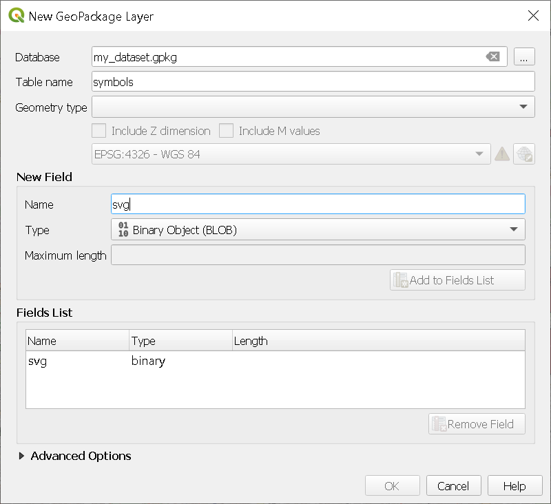

We talked about [how to collaborate on QGIS project](https://www.geothings.ch/posts/managing-shared-qgis-projects/) at a "project management" level, but in practice, how do you make things easy for you to easily share a project. Well, one way is to minimize the amount of files by:

* Storing your project in database
* Storing your data in database
* Storing your styles in database

## Introducing Geopackage

Geopackage is basically a SQLite database with well defined rules for storing geospatial data. You get a single file that can contain all your data, stored in different layers. The standard has been extended to allow [storage of QGIS projects](https://www.geopackage.org/extensions.html), which allows to bundle a lot into a single file.

## Storing your project in Geopackage

The first step would be to store your new project into a GPKG file. Open QGIS and create a new Geopackage database:

`Layer > Create a new layer > New Geopackage layer`

Then you can save your project in this newly created Geopackage:

`Project > Save To > GeoPackage...`

And that's it, you can then open this project from QGIS:

`Project > Open from > GeoPackage...`

You now have a Geopackage containing your project.

* GeoPackage

    * Project

## Storing your data in Geopackage

It's rather self-explanatory, your can store all the data used in your project in the same Geopackage. If you use shapefile, [please stop](http://switchfromshapefile.org/), it been making no sense for a while now.

Convert your data into Geopackage layer by right clicking on your layer of interest:

`Export > Save features as... > GeoPackage`

Select the Geopackage database containing your project as `File name`.

At this point you should already have your project and data in a single file, which is already way easier than managing multiple data sources.

* GeoPackage

    * Project
    * Data

        * layer 1
        * layer 2
        * ...

## Storing styles

Having your data stored is nice, but styles are also important to add symbologies and capabilities to your layers. Geopackage also allow to store your style directly. 

Define your layers styles (forms, symbologies, actions etc.) and then right click on your layer:

`Properties... > Symbology > Style > Save Style... > In Database`

And hey you can even go further! If you have .svg symbols in your style, you can load the symbol definition in the Geopackage. Like this you avoid broken links and unfound .svg file.

To do this, first create a new table in your Geopackage:

`Layer > Create Layer > New GeoPackage Layer...`

Select your Geopackage and fill the layer name (`symbols` or whatever you like). Then under `New Field`, add a field of type `Binary Object (BLOB)` and create the layer.

{: w="700"}
_Add svg to Geopackage_

Then add a new feature in your `symbols` and embed your .svg file in the BLOB column.

Finally, from your data layer symbology, select the `SVG Marker` symbol type and `Edit` the definition of the SVG with the rule of your choice, for example:

`'base64:'|| to_base64(attribute(get_feature( 'symbols', 'fid', 1), 'svg'))`

Here we'll use the symbol with the `fid` value 1. You can create the rule that wou want, but make sure to encode the binary definition into base64.

> You can also directly embed the file instead of creating the rule, you'll just lose some flexibility in the choice of you symbol. A rule-based choice would allow you to use different SVG definitions based on a attribute for example. 
{: .prompt-info }

At this point you should be in a situation like this:

* GeoPackage

    * Project
    * Data

        * layer 1

            * Style 1
            * Style 2
            * ...
        * layer 2

            * Style 1
            * Style 2
            * ...
        * ...

Which should be enough to cover the needs of most projects, all of this in a single file! Now it's way easier to share, and there is no risk of breaking a link.

## Conclusion

Easy right? And the best in all that, is that you can do exactly the same with a PostgreSQL database: storing your QGIS project, storing data (obviously) and storing your styles. It just take some "pre-procesing" by saving your data into your GPKG/PostgreSQL database, but you'll want to do that anyway, and if you don't, I assure you you want to.